# jq# (jqsharp) — Design Document

A pure C# implementation of the [jq](https://jqlang.github.io/jq/) JSON query language, operating on `System.Text.Json.JsonElement` values. The library parses a jq filter expression into an AST (abstract syntax tree) of `JqFilter` nodes, then evaluates it by threading a `JsonElement` input through the tree, producing zero or more `JsonElement` outputs.

---

## 1. High-Level Architecture

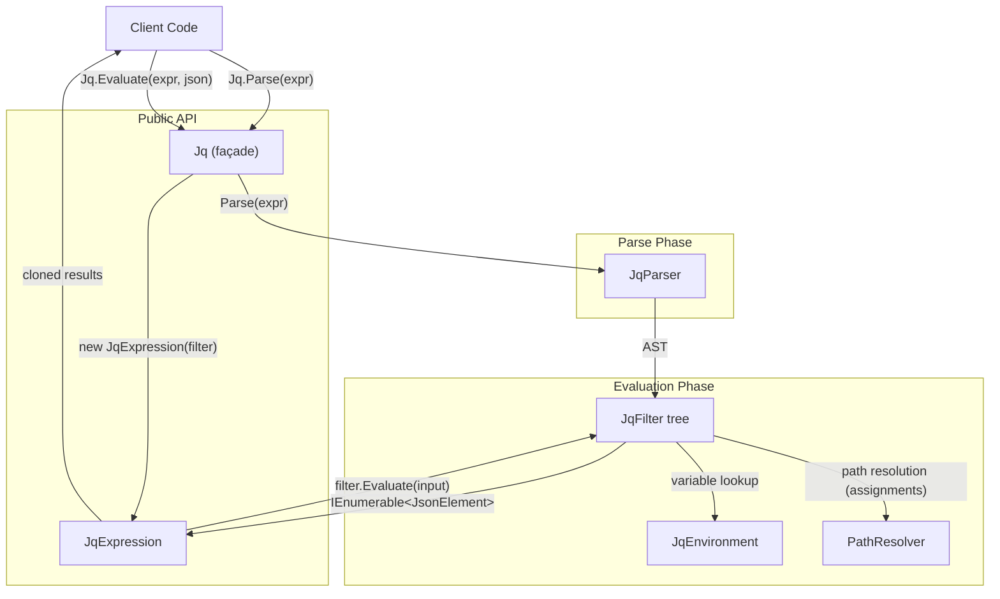

The system is organized as a **two-phase pipeline**:

| Phase | Entry Point | Responsibility |
|-------|-------------|----------------|
| **Parse** | `Jq.Parse(string)` → `JqExpression` | Tokenize + parse jq expression → reusable `JqExpression` wrapping a `JqFilter` AST |
| **Evaluate** | `JqExpression.Evaluate(JsonElement)` | Walk the AST, producing `IEnumerable<JsonElement>` |

The public façade `Jq` exposes `Parse()` to obtain a cacheable `JqExpression`, and `Evaluate()` as a convenience that combines both phases. `JqExpression` handles error translation and clones output elements to decouple them from the input `JsonDocument`. Both `JqExpression` and the underlying AST are immutable and thread-safe.

---

## 2. Project Structure

```
jqsharp/
├── JQSharp.slnx                # Solution (src + tests)
├── src/
│   ├── Benchmarks/
│   │   ├── Benchmarks.csproj        # BenchmarkDotNet harness for jq.exe vs jqsharp comparisons
│   │   ├── Program.cs               # 1M-message WhatsApp benchmark entry point
│   │   └── WhatsApp/
│   │       ├── Message.jq           # Benchmark query copied from Devlooped.WhatsApp
│   │       └── Text.json            # Benchmark sample payload copied from Devlooped.WhatsApp tests
│   ├── JQSharp/
│   │   ├── JQSharp.csproj           # Library — net10.0, System.Text.Json only
│   │   ├── Jq.cs                    # Public façade: Parse() and Evaluate()
│   │   ├── JqExpression.cs          # Parsed expression — cacheable, thread-safe
│   │   ├── JqParser.cs              # Recursive-descent parser
│   │   ├── JqFilter.cs              # Abstract base class for all filter nodes
│   │   ├── JqEnvironment.cs         # Immutable variable/filter-binding environment
│   │   ├── JqPattern.cs             # Destructuring pattern types
│   │   ├── JqException.cs           # Runtime error (carries optional JsonElement)
│   │   ├── JqBreakException.cs      # break control flow (label/break)
│   │   ├── JqHaltException.cs       # halt / halt_error control flow
│   │   ├── JqResolver.cs            # Abstract module resolver (include/import)
│   │   ├── JqFileResolver.cs        # File-system module resolver
│   │   ├── JqResourceResolver.cs    # Embedded-resource module resolver
│   │   ├── FilterClosure.cs         # Pairs a JqFilter with its captured environment
│   │   ├── PathResolver.cs          # Path algebra for assignment operators
│   │   ├── MathExtra.cs             # Custom math functions (erf, tgamma, Bessel, etc.)
│   │   ├── StrftimeFormat.cs        # strftime/strptime format rendering
│   │   └── Filters/                 # One file per AST node type (37 files)
│   │       ├── IdentityFilter.cs
│   │       ├── PipeFilter.cs
│   │       ├── CommaFilter.cs
│   │       ├── FieldFilter.cs
│   │       ├── IndexFilter.cs
│   │       ├── BuiltinFilter.cs     # All zero-arg builtins
│   │       ├── ParameterizedFilter.cs # All parameterized builtins
│   │       └── ...
│   └── Tests/
│       ├── Tests.csproj             # xUnit test project
│       ├── JqTestParser.cs          # Parses the jq test-suite format
│       ├── Jq*Tests.cs              # Category-based test classes (13 files)
│       └── suite/
│           └── jq.test              # jq test suite (~1 990 test cases)
└── docs/
    └── manual.md                # jq manual reference
```

---

## 2.1 Benchmark Project

The repository also includes a small BenchmarkDotNet console project under `src/Benchmarks/` for throughput comparisons against the `Devlooped.JQ` NuGet package. The current benchmark uses the WhatsApp `Message.jq` filter and sample webhook payload from `Devlooped.WhatsApp`, then processes a 1,000,000-message workload in three modes:

- `Devlooped.JQ`: batched execution through the bundled `jq.exe` process wrapper
- `Devlooped.JQSharp` without expression caching: `Jq.Evaluate(query, input)`
- `Devlooped.JQSharp` with expression caching: `Jq.Parse(query)` once, then `JqExpression.Evaluate(input)`

To keep the benchmark self-contained and repeatable, the WhatsApp query and sample payload are copied into the benchmark project and shipped as content files.

---

## 3. Parser Design

`JqParser` is a **hand-written recursive-descent parser** that operates directly on the source string via a cursor (`position`). There is no separate lexer/tokenizer stage — the parser consumes characters inline, using helper methods like `Peek()`, `Consume()`, `TryConsume()`, `TryConsumeKeyword()`, etc.

### 3.1 Operator Precedence (lowest → highest)

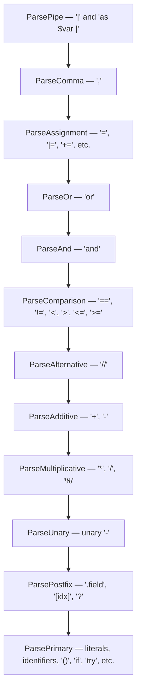

Each level is implemented as a method that calls the next-higher-precedence method, forming a classic Pratt-style precedence chain.

### 3.2 Parser State

| Field | Type | Purpose |
|-------|------|---------|
| `text` | `string` | Source expression |
| `position` | `int` | Current cursor |
| `_definedVariables` | `HashSet<string>` | Tracks `$var` declarations in scope (for error checking) |
| `_definedFunctions` | `Dictionary<(string,int), UserFunctionDef>` | User `def` declarations by (name, arity) |
| `_definedFilterParams` | `HashSet<string>` | Filter parameters currently in scope |

The parser scopes variables and functions by **temporarily adding them** before parsing the body, then **removing them** afterward (via try/finally). This allows accurate compile-time detection of undefined variables without building a full scope tree.

### 3.3 Identifier Resolution Order

When the parser encounters a bare identifier (e.g., `foo`):

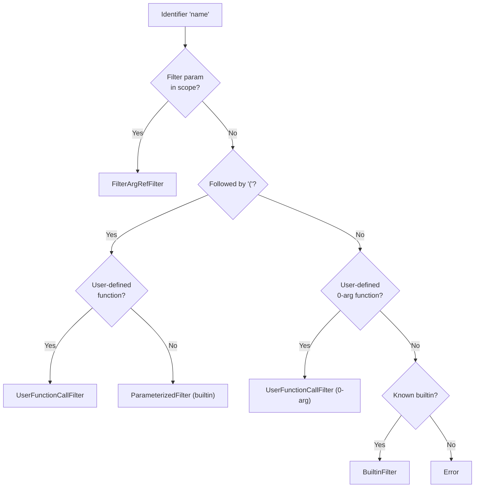

---

## 4. AST Node Hierarchy

All filter nodes inherit from the abstract `JqFilter` base class:

```mermaid
classDiagram
    class JqFilter {
        <<abstract>>
        +Evaluate(JsonElement, JqEnvironment) IEnumerable~JsonElement~
        #CreateElement(Action~Utf8JsonWriter~) JsonElement
        #CreateNumberElement(double) JsonElement
        #CreateStringElement(string) JsonElement
        #CreateBooleanElement(bool) JsonElement
        #CreateNullElement() JsonElement
        #IsTruthy(JsonElement) bool
        #CompareElements(JsonElement, JsonElement) int
        +StructurallyEqual(JsonElement, JsonElement) bool
    }

    JqFilter <|-- IdentityFilter
    JqFilter <|-- LiteralFilter
    JqFilter <|-- FieldFilter
    JqFilter <|-- IndexFilter
    JqFilter <|-- SliceFilter
    JqFilter <|-- IterateFilter
    JqFilter <|-- DynamicIndexFilter
    JqFilter <|-- PipeFilter
    JqFilter <|-- CommaFilter
    JqFilter <|-- BinaryOpFilter
    JqFilter <|-- AlternativeFilter
    JqFilter <|-- NegateFilter
    JqFilter <|-- NotFilter
    JqFilter <|-- ConditionalFilter
    JqFilter <|-- TryCatchFilter
    JqFilter <|-- RecurseFilter
    JqFilter <|-- ArrayFilter
    JqFilter <|-- ObjectFilter
    JqFilter <|-- StringInterpolationFilter
    JqFilter <|-- FormattedStringFilter
    JqFilter <|-- FormatFilter
    JqFilter <|-- BuiltinFilter
    JqFilter <|-- ParameterizedFilter
    JqFilter <|-- VariableFilter
    JqFilter <|-- BindingFilter
    JqFilter <|-- FilterArgRefFilter
    JqFilter <|-- ReduceFilter
    JqFilter <|-- ForeachFilter
    JqFilter <|-- UserFunctionDef
    JqFilter <|-- UserFunctionCallFilter
    JqFilter <|-- UpdateAssignmentFilter
    JqFilter <|-- PlainAssignmentFilter
    JqFilter <|-- CompoundAssignmentFilter
```

### 4.1 Node Categories

| Category | Nodes | Purpose |
|----------|-------|---------|
| **Access** | `IdentityFilter`, `FieldFilter`, `IndexFilter`, `SliceFilter`, `IterateFilter`, `DynamicIndexFilter` | Navigate/select values from JSON |
| **Composition** | `PipeFilter`, `CommaFilter` | Combine filters sequentially or in parallel |
| **Arithmetic/Logic** | `BinaryOpFilter`, `NegateFilter`, `NotFilter`, `AlternativeFilter` | Math, comparison, boolean, alternative (`//`) |
| **Control Flow** | `ConditionalFilter`, `TryCatchFilter`, `RecurseFilter` | Branching, error handling, recursion |
| **Construction** | `ArrayFilter`, `ObjectFilter`, `LiteralFilter`, `StringInterpolationFilter`, `FormattedStringFilter`, `FormatFilter` | Build new JSON values |
| **Builtins** | `BuiltinFilter`, `ParameterizedFilter` | ~40 zero-arg + ~50 parameterized builtin functions |
| **Binding** | `VariableFilter`, `BindingFilter`, `FilterArgRefFilter`, `ReduceFilter`, `ForeachFilter` | Variable binding, destructuring, iteration |
| **User Functions** | `UserFunctionDef`, `UserFunctionCallFilter` | `def name(args): body;` |
| **Assignment** | `UpdateAssignmentFilter`, `PlainAssignmentFilter`, `CompoundAssignmentFilter` | `\|=`, `=`, `+=`, `-=`, etc. |

---

## 5. Evaluation Model

### 5.1 Core Principle: Generators

Every `JqFilter.Evaluate()` returns `IEnumerable<JsonElement>` — zero, one, or many results. This is the fundamental abstraction: **filters are generators**. This matches jq semantics where every expression can produce multiple outputs (e.g., `.[]` iterates, `,` concatenates streams).

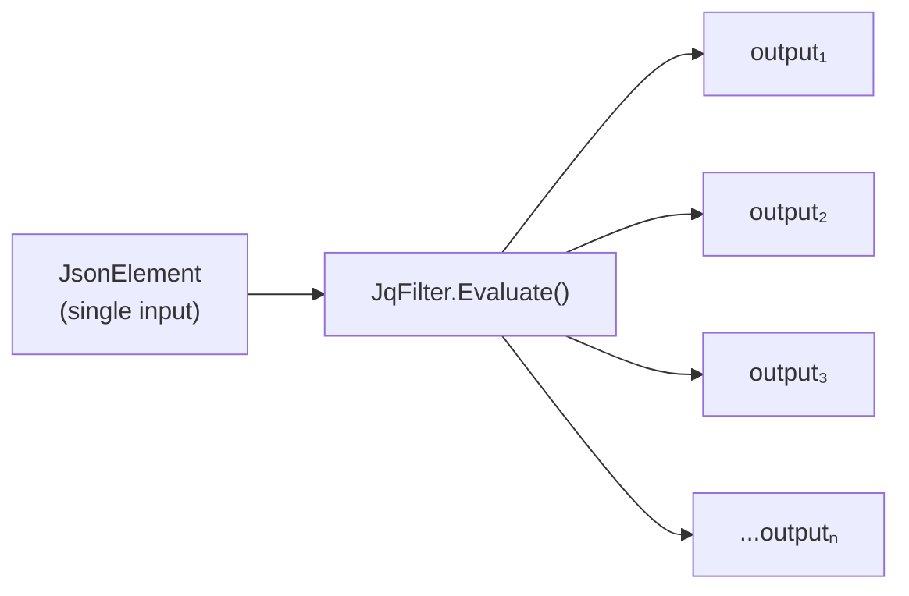

### 5.2 Pipe Semantics

`PipeFilter` implements the cartesian-product threading model:

```csharp
foreach (var intermediate in left.Evaluate(input, env))
    foreach (var value in right.Evaluate(intermediate, env))
        yield return value;
```

Each output of the left filter becomes the input of the right filter. All results are concatenated.

### 5.3 Environment Threading

`JqEnvironment` is an **immutable** data structure (built on `ImmutableDictionary`) that carries:

| Binding Type | Storage | Purpose |
|---|---|---|
| **Value bindings** | `ImmutableDictionary<string, JsonElement>` | `$var` values from `as $var`, `reduce`, `foreach` |
| **Filter bindings** | `ImmutableDictionary<string, FilterClosure>` | Filter arguments from `def f(g): ...` |

Immutability means each binding operation returns a **new** environment. This naturally handles scoping — deeper scopes see a superset of their parent's bindings without mutation.

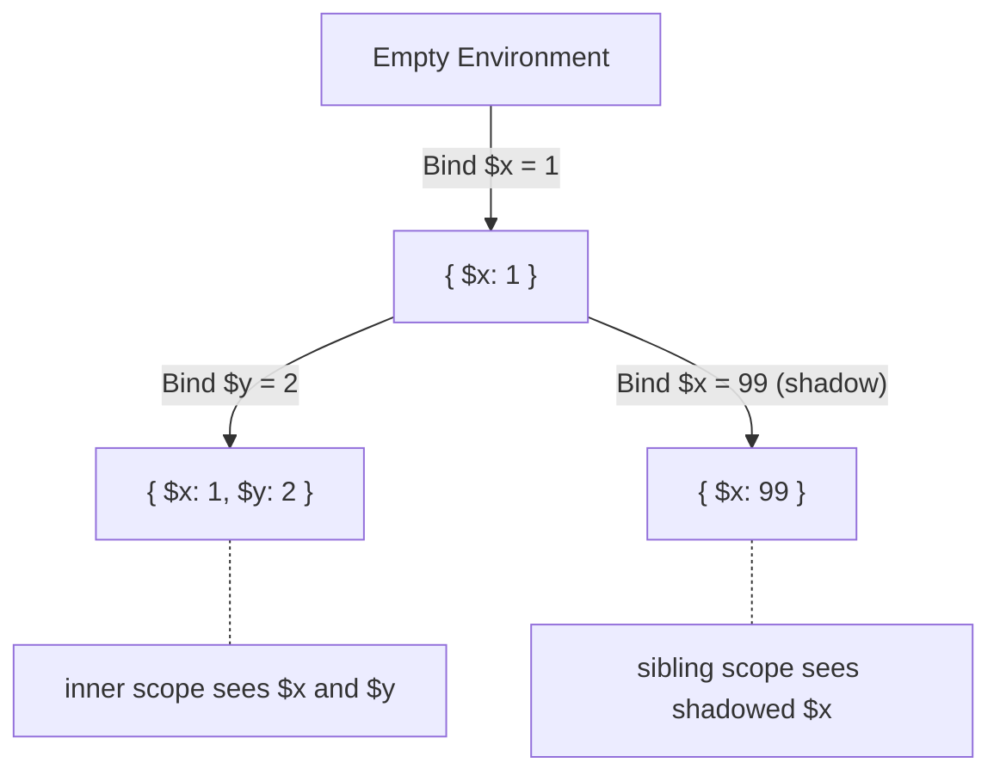

### 5.4 FilterClosure

A `FilterClosure` pairs a `JqFilter` with the `JqEnvironment` captured at the point of definition. This implements **lexical scoping** for filter arguments passed to user-defined functions:

```csharp
record FilterClosure(JqFilter Filter, JqEnvironment CapturedEnv);
```

When a filter argument is invoked (via `FilterArgRefFilter`), it evaluates using its captured environment, not the caller's environment.

---

## 6. Destructuring Patterns

The `JqPattern` hierarchy supports destructuring in `as`, `reduce`, and `foreach`:

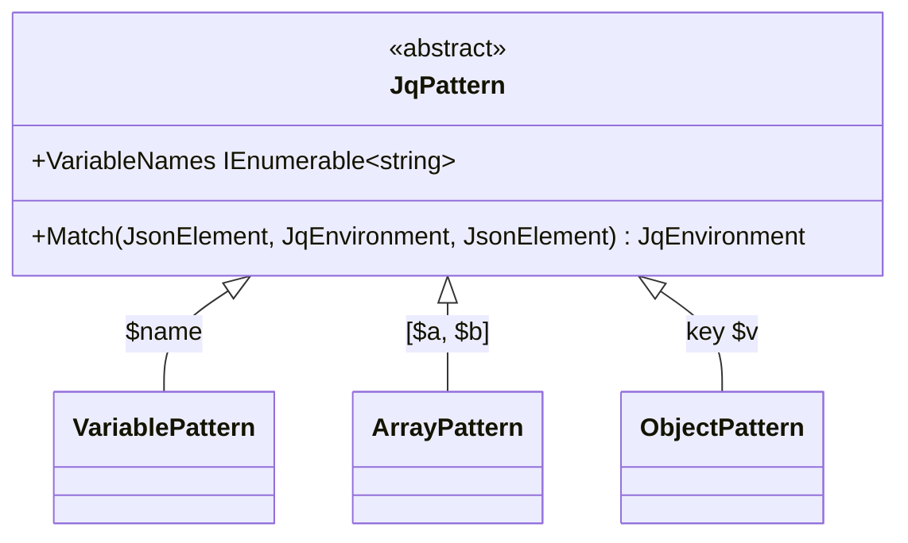

`Match()` takes a value and an existing environment, and returns a **new** environment with the matched variables bound. The patterns are recursive — an `ArrayPattern` can contain `ObjectPattern` elements and vice versa.

---

## 7. Assignment & Path Resolution

Assignment operators (`=`, `|=`, `+=`, etc.) require resolving the **paths** that a filter expression refers to, rather than evaluating it. This is handled by `PathResolver`.

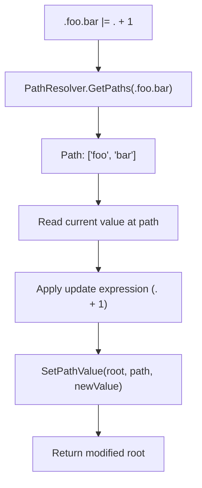

### 7.1 Path Representation

Paths are `JsonElement[]` arrays where each element is either:
- A `JsonValueKind.String` (object key)
- A `JsonValueKind.Number` (array index)

### 7.2 PathResolver Methods

| Method | Purpose |
|--------|---------|
| `GetPaths(filter, input, env)` | Resolve a filter expression to its constituent paths |
| `TryGetPathValue(source, path)` | Read the value at a path |
| `SetPathValue(source, path, value)` | Return a new root with value set at path |
| `DeletePathValue(source, path)` | Return a new root with value at path removed |

All mutations are non-destructive — they create new `JsonElement` trees via `Utf8JsonWriter`.

---

## 8. Builtin Function Architecture

### 8.1 Zero-Argument Builtins (`BuiltinFilter`)

Dispatched via a `switch` expression on the function name (~40 builtins). All are methods within the single `BuiltinFilter` class. Examples:

| Category | Functions |
|----------|-----------|
| Generator | `empty` |
| Type introspection | `type`, `length`, `infinite`, `nan`, `isinfinite`, `isnan`, `isfinite`, `isnormal` |
| Type selectors | `arrays`, `objects`, `strings`, `numbers`, `nulls`, `values`, `scalars`, ... |
| Collection ops | `keys`, `sort`, `unique`, `flatten`, `reverse`, `add`, `min`, `max`, ... |
| Conversion | `tonumber`, `tostring`, `tojson`, `fromjson`, `explode`, `implode`, ... |
| Date/Time | `now`, `todate`, `todateiso8601`, `fromdate`, `fromdateiso8601`, `gmtime`, `localtime`, `mktime` |
| Math (one-input) | `abs`, `floor`, `sqrt`, `ceil`, `round`, `trunc`, `sin`, `cos`, `tan`, `acos`, `asin`, `atan`, `sinh`, `cosh`, `tanh`, `acosh`, `asinh`, `atanh`, `exp`, `exp2`, `expm1`, `log`, `log2`, `log10`, `logb`, `log1p`, `cbrt`, `fabs`, `erf`, `erfc`, `tgamma`, `lgamma`, `j0`, `j1`, `nearbyint`, `modf`, `frexp` |

### 8.2 Parameterized Builtins (`ParameterizedFilter`)

Dispatched via a `switch` on `(name, args.Length)` (~50 signatures). Examples:

| Category | Functions |
|----------|-----------|
| Testing | `has/1`, `contains/1`, `select/1`, `any/1`, `all/1`, ... |
| String ops | `startswith/1`, `split/1`, `join/1`, `sub/2`, `gsub/2`, ... |
| Collection | `map/1`, `sort_by/1`, `group_by/1`, `unique_by/1`, ... |
| Generators | `range/1..3`, `limit/2`, `while/2`, `until/2`, `repeat/1`, ... |
| Regex | `test/1..2`, `match/1..2`, `capture/1..2`, `scan/1..2`, `sub/2..3`, `gsub/2..3` |
| Paths | `path/1`, `del/1`, `getpath/1`, `setpath/2`, `delpaths/1`, ... |
| Date/Time | `strptime/1`, `strftime/1`, `strflocaltime/1` |
| Math (multi-input) | `pow/2`, `atan2/2`, `fmax/2`, `fmin/2`, `fmod/2`, `hypot/2`, `remainder/2`, `ldexp/2`, `scalbln/2`, `fma/3` |

### 8.3 User-Defined Functions

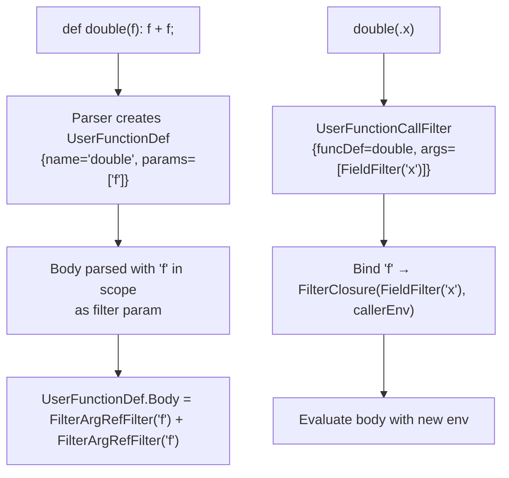

Functions support:
- **Filter arguments** (`def f(g): ...`) — `g` is a filter, bound as `FilterClosure`
- **Value arguments** (`def f($x): ...`) — sugar that expands to `def f(x): x as $x | ...`
- **Multiple arity** — `def f: ...;` and `def f(a): ...;` can coexist
- **Recursion** — the function definition is registered before its body is parsed

---

## 9. Error Handling

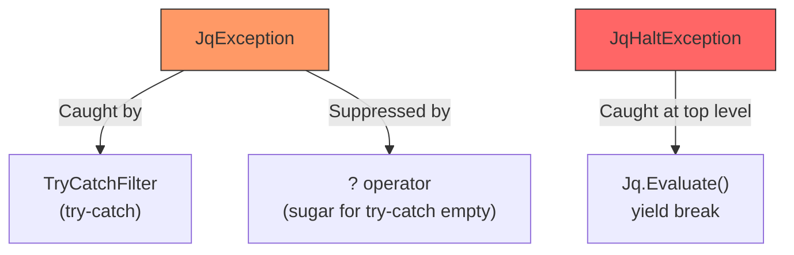

| Exception | Purpose | Catchable? |
|-----------|---------|------------|
| `JqException` | Runtime errors (type errors, undefined vars, `error` builtin) | Yes, via `try-catch` |
| `JqHaltException` | `halt` / `halt_error(code)` — terminates evaluation | No, caught only at `Jq.Evaluate()` |

`JqException` optionally carries a `JsonElement` value (from `error` builtin), which is passed to the catch filter.

---

## 10. JSON Element Construction

Since `System.Text.Json.JsonElement` is immutable and read-only, all construction of new JSON values goes through `Utf8JsonWriter`:

```csharp
protected static JsonElement CreateElement(Action<Utf8JsonWriter> write)
{
    var buffer = new ArrayBufferWriter<byte>();
    using var writer = new Utf8JsonWriter(buffer);
    write(writer);
    writer.Flush();
    using var document = JsonDocument.Parse(buffer.WrittenMemory);
    return document.RootElement.Clone();
}
```

Convenience methods `CreateNumberElement`, `CreateStringElement`, `CreateBooleanElement`, and `CreateNullElement` wrap this pattern. The `CreateNumberElement` method preserves integer representation when possible (writes `long` instead of `double` when the value has no fractional part).

Math functions that produce IEEE 754 special values are mapped to JSON-compatible representations: `NaN` → `null`, `+∞` → `1.7976931348623157e+308` (`double.MaxValue`), `-∞` → `-1.7976931348623157e+308`. The `CreateMathResult` helper in `JqFilter` handles this conversion. Custom implementations for `erf`, `erfc`, `tgamma`, `lgamma`, `j0`, `j1` (not available in `System.Math`) are provided in `MathExtra.cs` using numerical approximations (Abramowitz & Stegun for erf, Lanczos for gamma, polynomial for Bessel).

---

## 11. Format Strings

The `@format` system supports 10 output formats:

| Format | Description |
|--------|-------------|
| `@text` | String passthrough (non-strings get JSON serialization) |
| `@json` | JSON serialization |
| `@html` | HTML entity escaping (`<`, `>`, `&`, `'`, `"`) |
| `@uri` | RFC 3986 percent-encoding |
| `@urid` | URI decoding |
| `@csv` | Comma-separated values |
| `@tsv` | Tab-separated values |
| `@sh` | Shell quoting (single-quote wrapping) |
| `@base64` | Base64 encoding |
| `@base64d` | Base64 decoding |

`FormattedStringFilter` handles the combined `@format "string \(expr)"` syntax, where literal parts pass through unchanged and interpolated expressions have the format applied.

---

## 11.1 Date Functions

The date function system provides Unix timestamp manipulation and formatting:

### Broken-Down Time Array

Several date functions use an 8-element "broken-down time" array (matching C's `struct tm`):

| Index | Field | Range | Notes |
|-------|-------|-------|-------|
| 0 | Year | full year (e.g., 2015) | |
| 1 | Month | 0–11 | 0 = January |
| 2 | Day | 1–31 | |
| 3 | Hour | 0–23 | |
| 4 | Minute | 0–59 | |
| 5 | Second | 0–59 | |
| 6 | Weekday | 0–6 | 0 = Sunday |
| 7 | Year-day | 0–365 | 0-based |

### strftime Format Conversion

Since .NET uses different format specifiers than C's `strftime`, a custom `StrftimeFormat` utility class (`StrftimeFormat.cs`) provides direct rendering by walking the format string character-by-character. It supports all standard `%`-codes (`%Y`, `%m`, `%d`, `%H`, `%M`, `%S`, `%Z`, `%j`, `%u`, `%w`, `%a`, `%A`, `%b`, `%B`, `%G`, `%V`, etc.) and a corresponding `Parse` method for `strptime`.

### Timezone Behavior

- `gmtime`, `todate`, `strftime` — always UTC
- `localtime`, `strflocaltime` — use `TimeZoneInfo.Local`
- `now` — returns `DateTimeOffset.UtcNow` as Unix timestamp (non-deterministic)

---

## 11.2 Advanced Control Flow

### label/break

The `label $name | body` construct creates a breakable scope. Within the body, `break $name` throws a `JqBreakException` (which extends `Exception` directly, not `JqException`, so it is NOT caught by `try-catch` or `?`). The `LabelFilter` collects results from the body until either the body completes or a matching `JqBreakException` is caught.

```csharp
// New exception class
public sealed class JqBreakException(string label) : Exception("break")
```

The parser tracks label scopes via `_definedVariables` using the special internal name `*label-NAME` (which cannot be entered by user code). `break $name` at parse time verifies that a matching `label $name` is in scope; if not, it throws a parse error with message `$*label-NAME is not defined`.

New AST nodes:
- `LabelFilter(string labelName, JqFilter body)` — catches matching `JqBreakException`
- `BreakFilter(string labelName)` — throws `JqBreakException`

### Destructuring Alternative Operator `?//`

`EXPR as PAT1 ?// PAT2 ?// ... | BODY` tries each pattern left-to-right:
- **`ObjectPattern`** only matches `JsonValueKind.Object` values
- **`ArrayPattern`** only matches `JsonValueKind.Array` values  
- **`VariablePattern`** matches any value (universal fallback)

Variables from non-matched patterns are bound to `null` in the environment. If no pattern matches, a `JqException` is thrown.

The `JqPattern` base class gained a `TryMatch()` virtual method with type pre-checks in `ObjectPattern` and `ArrayPattern`. The parser's `as` binding section was extended to collect multiple `?//`-separated patterns.

New AST node: `DestructuringAlternativeFilter(JqFilter expression, JqPattern[] patterns, JqFilter body)`

### SQL-style Operators

Added to `ParameterizedFilter` (uppercase, case-sensitive, distinct from lowercase `in/1` and `index/1`):

| Function | Arity | Description |
|----------|-------|-------------|
| `INDEX` | 1 | `INDEX(key_expr)` — input is array; builds object mapping key→element |
| `INDEX` | 2 | `INDEX(stream; key_expr)` — builds object from stream items keyed by key_expr |
| `IN` | 1 | `input \| IN(stream)` — true if input is structurally equal to any stream item |
| `IN` | 2 | `IN(generator; stream)` — true if any generator output appears in stream |
| `JOIN` | 2 | `JOIN(index_obj; key_expr)` — joins input array elements with index object, yields array of `[element, lookup]` pairs |

Key coercion: numeric keys are converted to strings using `GetRawText()` (so `0` → `"0"`).

---

## 12. Test Architecture

Tests use **xUnit** with a data-driven approach:

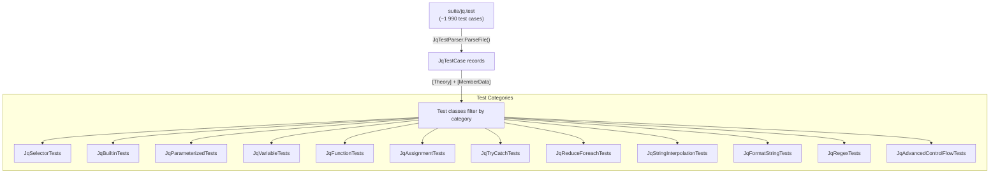

### 12.1 Test Suite Format

The `jq.test` file uses a simple line-based format:

```
# Comment / separator
filter_expression
input_json
expected_output_1
expected_output_2
```

Failed-parse tests use `%%FAIL` markers. Each test class filters the suite by inspecting the program text (e.g., checking for specific keywords or syntax patterns) to select only relevant test cases.

### 12.2 Test Case Record

```csharp
record JqTestCase(
    string Program,           // jq filter expression
    string Input,             // JSON input
    string[] ExpectedOutputs, // expected JSON outputs
    bool ShouldFail,          // true for %%FAIL tests
    string? ExpectedError,    // expected error message
    int LineNumber);          // line number in jq.test
```

---

## 13. Design Decisions & Trade-offs

### Parse-Once, Evaluate-Many
`Jq.Parse()` returns a `JqExpression` that wraps the internal `JqFilter` AST without exposing it. Consumers can cache a `JqExpression` and call `Evaluate()` repeatedly against different inputs, avoiding the cost of re-parsing. The `JqExpression` type is sealed with an internal constructor, so it cannot be subclassed or instantiated outside the library. `Jq.Evaluate(string, JsonElement)` remains as a convenience one-liner that calls `Parse` then `Evaluate`.

### No External Dependencies
The library uses only `System.Text.Json` from the BCL. There are no third-party parser generators, JSON libraries, or utility packages.

### Immutable JSON
All operations create new `JsonElement` values rather than mutating existing ones. This is both a necessity (JsonElement is immutable) and a feature (no aliasing bugs, thread-safe evaluation).

### Monolithic Builtin Classes
`BuiltinFilter` and `ParameterizedFilter` are large single classes with switch-based dispatch. This trades file size for simplicity — no registration system, no reflection, no plugin architecture.

### Parser Without Lexer
Combining lexing and parsing in a single pass simplifies the implementation but makes the parser sensitive to character-level details (e.g., distinguishing `/` from `//` from `//=`).

### Generator-Based Evaluation
Using `IEnumerable<JsonElement>` with `yield return` matches jq's semantics naturally. However, some operations (like `TryCatchFilter`) must eagerly materialize results with `.ToArray()` to properly handle exceptions, since C# iterators cannot yield inside try-catch blocks.

---

## 14. Module System (`include`, `import`, `module`, `modulemeta`)

### 14.1 Overview

JQSharp supports four module/data-loading forms:

| Form | Purpose | Scope behavior |
|------|---------|----------------|
| `include "relative/path" [<metadata>];` | Inline a jq module at parse time | Definitions become directly visible (unqualified names). |
| `import "relative/path" as alias [<metadata>];` | Import jq `def` declarations under a namespace alias | Definitions are exposed as `alias::name`. |
| `import "relative/path" as $alias [<metadata>];` | Import JSON data as a variable binding | Data is bound as `$alias::alias`. |
| `module <metadata>;` | Attach declarative metadata to module file | No direct evaluation effect; consumed by `modulemeta`. |

`include` performs content splicing into the current parse stream. `import` does not splice caller text: it either registers alias-prefixed function definitions (module import) or introduces a scoped variable binding (data import). `module` is a top-of-module declarative statement.

### 14.2 JqResolver

`JqResolver` is an abstract base class (inspired by `XmlUrlResolver`) that decouples path resolution for both `include` and `import`:

```csharp
public abstract class JqResolver
{
    // Resolve a path to a TextReader over its content.
    public abstract TextReader Resolve(string path, string? fromPath);

    // Returns a stable cache key for the resolved module/data (default: returns path unchanged).
    public virtual string GetCanonicalPath(string path, string? fromPath) => path;
}
```

Two built-in implementations are provided:

| Class | Description |
|-------|-------------|
| `JqFileResolver` | Resolves paths on the file system. Appends `.jq` when no extension is present. Relative paths are resolved from the including/importing module's directory (or `BaseDirectory` for top-level calls). |
| `JqResourceResolver` | Resolves paths to embedded assembly resources. Slashes are converted to dots; a configurable `Prefix` is prepended; supports nested relative include/import chains. `GetCanonicalPath` checks the **original input path** for `.jq`/`.json` before dot-normalization, and appends `.jq` only when neither extension exists. |

### 14.3 Module Metadata Registry and Statement

The parser now maintains a shared metadata registry across nested parser instances:

- `Dictionary<string, JsonElement> _moduleMetadataRegistry`

Keying:

- Key is the relative path token used by jq source (`"foo"` in `import "foo" as m;`), not canonical resolver path.

Every module can optionally begin with:

```jq
module {"version": "1.0", "homepage": "https://example.com"};
```

Implementation details:

1. `ParsePrimary()` recognizes `module` keyword and dispatches `ParseModuleStatement()`.
2. The metadata expression is parsed as normal jq expression and immediately evaluated against `null` input with `JqEnvironment.Empty`.
3. Result must be a single object value; it is stored as `_moduleStatementMetadata`.
4. Statement consumes `;` and parsing continues with `ParsePipe()`.

### 14.4 Include Parse-Time Content Splicing

`include` is handled entirely at parse time using a **content-splice** strategy:

```
include "foo"; rest_of_program
```

becomes (conceptually):

```
<content of foo.jq>
rest_of_program
```

When `ParseIncludeExpression()` is invoked:

1. The module path string is parsed (no interpolation allowed).
2. An optional metadata object `{...}` is parsed and preserved for dependency metadata.
3. The terminating `;` is consumed.
4. `GetCanonicalPath()` produces the cache key; if cached, file/resource IO is skipped.
5. The module is parsed in isolation first to populate metadata registry (`module` keys, `deps`, `defs`).
6. The parser captures the remaining caller text (`text[position..]`).
7. Combined text is built as `moduleContent + "\n" + remainingText`.
8. `ParseSubExpression(combinedText, canonicalPath)` parses the combined stream in a child parser.
9. The parent advances `position` to `text.Length` because continuation is consumed by the child.

### 14.5 Import Parse Pipeline (Phase 16.3)

`import` first parses the shared prefix, then dispatches:

```csharp
import "path" as alias;
import "path" as $alias;
```

- `as alias` → `ParseFunctionImport(modulePath)`
- `as $alias` → `ParseDataImport(modulePath)`

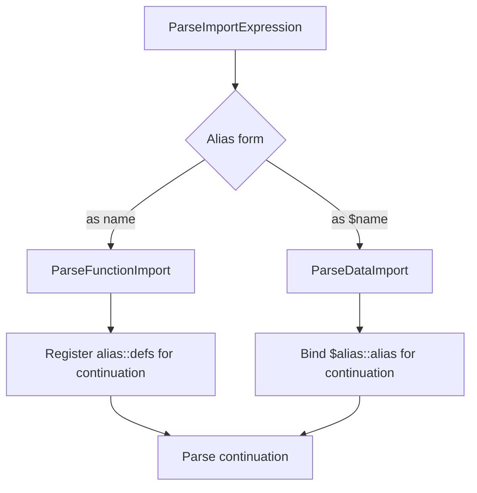

### 14.6 Function Import: Parse-Time Definition Extraction

Function import extracts only exported `def` declarations from the child parse and re-registers them in the parent under `alias::` names.

1. `ParseFunctionImport` resolves and caches the module source (same cache and resolver path flow as `include`).
2. A child parser is created with `moduleContent + "\n."` and `_exportedDefs = new()`. The trailing `.` makes the child parse a complete jq expression after module definitions.
3. During child parse, each `def` goes through `ParseDefExpression()`. After `funcDef.Body` is finalized, `_exportedDefs?[key] = funcDef` records the definition.
4. Parent parser iterates the child `_exportedDefs` and registers:
   - `(foo, 1)` → `(NAME::foo, 1)` when alias is `NAME`
5. Parent parses continuation (`ParsePipe()`), with imported names available.
6. In `finally`, imported keys are removed, so alias-prefixed defs are scoped to continuation parsing.

Snippet of the registration lifecycle:

```csharp
var parser = new JqParser(moduleContent + "\n.", _resolver, _moduleCache, canonicalPath)
{
    _exportedDefs = new()
};

parser.Parse();

foreach (var kvp in parser._exportedDefs)
    _definedFunctions[($"{alias}::{kvp.Key.Name}", kvp.Key.Arity)] = kvp.Value;

try
{
    return ParsePipe();
}
finally
{
    // remove imported defs
}
```

### 14.7 Data Import: Variable Binding

Data import (`import "data" as $cfg;`) loads JSON and binds it as a scoped variable named `$cfg::cfg`.

1. Path resolution uses `.json` by default:
   - If module path already ends with `.json` (case-insensitive), keep it.
   - Otherwise append `.json`.
2. Content is loaded through resolver/cache and parsed using `JsonDocument.Parse`.
3. Parsed value is cloned to `JsonElement` and wrapped in `LiteralFilter`.
4. Continuation is wrapped in:
   - `BindingFilter(new LiteralFilter(json), new VariablePattern("cfg::cfg"), body)`
5. If JSON parsing fails, `JsonException` is wrapped as:
   - `JqException("Failed to parse JSON data from '...': ...")`

### 14.8 Qualified Name Resolution (`::`)

`ParsePrimary()` supports `::` for both variable and identifier/function references.

| Target | Parse shape | Resolution behavior |
|--------|-------------|---------------------|
| Variable | `$name::member` | Looked up only in `_definedVariables` (plus special `$ENV`, `$__loc__`). Undefined raises `"$name::member is not defined"`. |
| Identifier/function | `name::member` or `name::member(...)` | Marked as qualified. Qualified names skip filter-parameter and builtin fallback checks. Resolution is only against `_definedFunctions`; undefined raises explicit module errors (`Undefined module function 'name::member'` or `'name::member/arity'`). |

This ensures module-qualified symbols are explicit and never accidentally treated as builtins or filter parameters.

### 14.9 Metadata Object Shape (`modulemeta`)

For each imported/included module, registry stores a metadata object:

```json
{
  "...custom-module-keys": "...",
  "deps": [
    {
      "relpath": "path",
      "as": "alias-or-null",
      "is_data": false,
      "...import/include-metadata-keys": "..."
    }
  ],
  "defs": ["name/arity"]
}
```

Notes:

- `deps` entries are recorded for `include`, function `import`, and data `import`.
- `as` is `null` for `include`.
- `is_data` is `true` only for `import ... as $alias`.
- `defs` is collected from exported defs discovered when parsing module in import/metadata-collection mode.

### 14.10 Runtime Environment Injection

`JqEnvironment` now carries immutable module metadata map. At parse entrypoint, when metadata registry is non-empty, parsed filter is wrapped in `ModuleMetadataFilter` which injects metadata into the evaluation environment.

### 14.11 `modulemeta` builtin

`modulemeta` is a zero-arg builtin that consumes input as module name:

```jq
"foo" | modulemeta
```

Behavior:

- Input must be string, else error: `modulemeta input must be a string`
- Unknown module name errors: `Unknown module: 'foo'`
- Returns metadata object with custom keys plus `deps` and `defs`

### 14.12 Caching

The parser now uses two shared dictionaries across nested parse operations in one `Jq.Parse()` call:

- `_moduleCache` (canonical path -> module text)
- `_moduleMetadataRegistry` (relative module path -> metadata object)

### 14.13 Public API

```csharp
// Pass a resolver to enable include/import support.
var resolver = new JqFileResolver("/my/modules");

JqExpression includeExpr = Jq.Parse("include \"utils\"; utils_fn", resolver);
JqExpression importExpr = Jq.Parse("import \"math\" as M; M::sum(.; 10)", resolver);
JqExpression dataExpr = Jq.Parse("import \"config\" as $cfg; $cfg::cfg.threshold", resolver);
```

When no resolver is provided (default `null`), any `include` or `import` statement throws a `JqException`.
